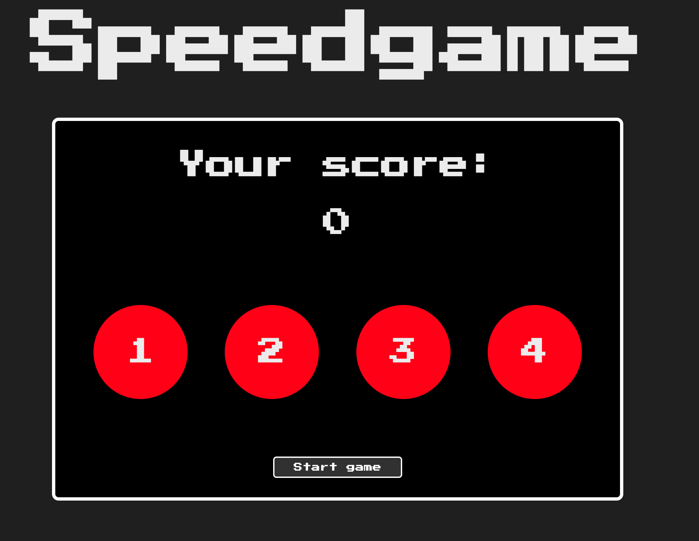

# Speedgame:

This Game project is built for our JavaScript course under Helsinki Business School.
Click on a highlighted circle, speed will be increased be getting your score.

- Every right click score will be added.
- If you failed to click 3 times in a row then game will be over.

## Tech Stack Used

- HTML
- JS
- CSS

## Screenshot

## Setup and usage

Game is up and running [here](https://public.bc.fi/s2300110/speed_game/)

## Limitation of the projects

- No sounds added
- CSS could be improved with animation

## Lerning Outcome from this project

- Understading DOM
- Understading game logic building
- Helped me to understand asynchronous programming

## Authors and acknowledgment

- GitHub @Monsur Saleh
-
